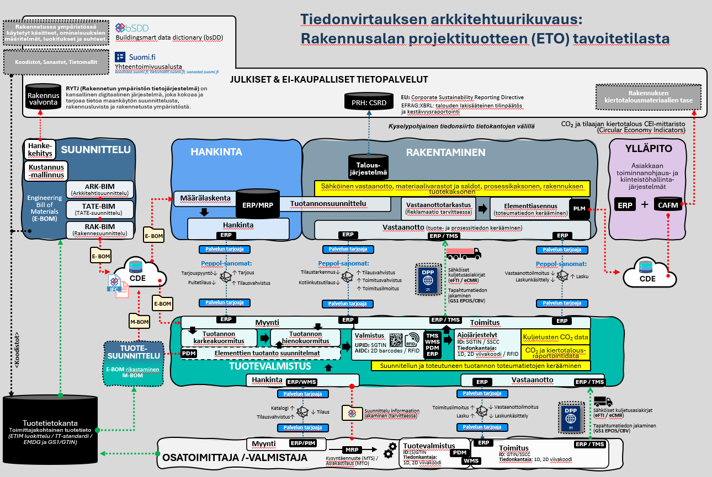

BETK (Betonielementin toimitusketju) on Rakennusteollisuus RT:n kehityshankkeen tuottama tietomalli- ja tietokenttäkokoelma. Se vakioi rakennushankkeen tietomalleissa käytettävät ominaisuusarvot siten, että tietoa voidaan siirtää koneluettavasti hankkeen toimijoiden välillä.

Aikaisempaan [BEC2012](https://www.elementtisuunnittelu.fi/suunnitteluprosessi/mallintava-suunnittelu) -malliin verrattuna BETK:

- määrittää sallitut arvot tietokentille
- mahdollistaa elementtityyppien automaattisen tunnistamisen IFC-tietomallista
- tietokenttien ryhmittely ja päivityksiä nimeämiseen

