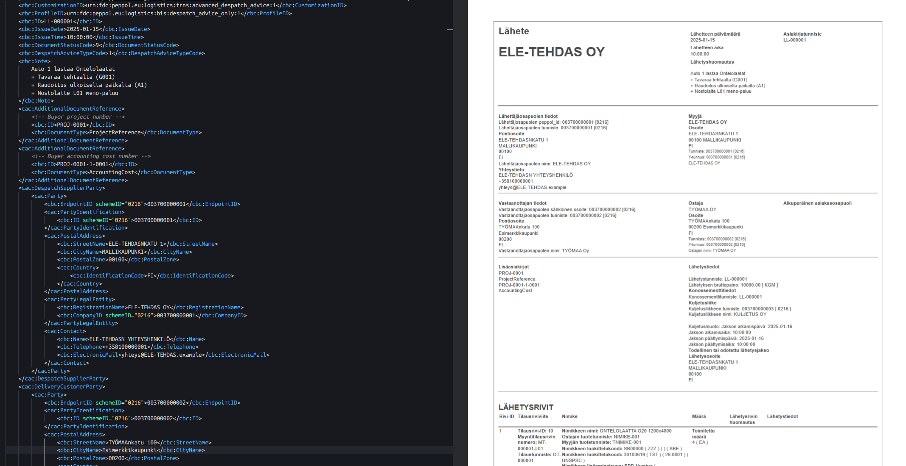

Peppolit ovat standardisoituja asiakirjoja. Operaattorit varmistavat, että jokainen peppol verkon kautta lähetetty sanoma on rakenteeltaan samanlainen. Tämä tarkoittaa, että sanoman vastanottava järjestelmä tietää aina mistä tieto löytyy, riippumatta kuka sanoman lähettää. Yksittäinen Peppol on .xml tiedosto. Se ei ota kantaa miltä asiakirja näyttää loppukäyttäjälle, se kertoo mitä tietoa välitetään. 

Vapaa käännös suomeksi bis_presentation_xslt työkalua käyttäen. Sama työkalu osaa näyttää peppol.xml tiedoston .pdf muodossa.
