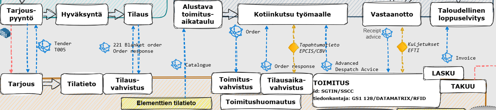

Peppol on joustava. Vaikka puhutaan standardista, voi niiden tietosisällön määritellä toimialakohtaisesti. 

Rakennusalan toimitusketjussa on monta prosessivaihetta missä luotu data "tapetaan" pdf muotoon ja lähetetään sähköpostilla eteenpäin. Oheisessa kuvassa näkyy betonielementin toimitusketjun keskeiset vaiheet.

Valtionkonttorin avustuksella on kartoitettu peppolin tietosisältöä betonielementin elämän eri vaiheisiin. Ensimmäisenä on keskitytty tilaus-toimitus vaiheen sanomiin.
